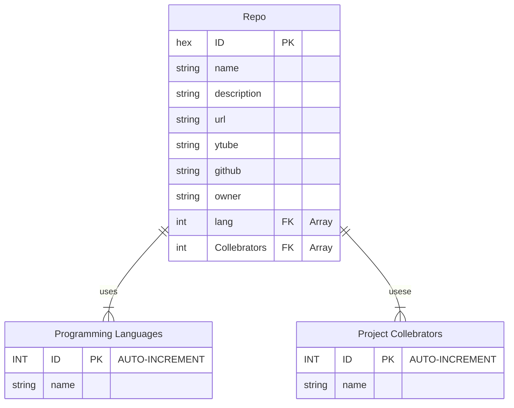

##  Visual presentation of the Database

```mermaid
erDiagram
    "Repo" ||--|{ "Programming Languages": uses
    "Repo" ||--|{ "Project Collebrators": usese 

    Repo {
        hex ID PK
        string name
        string description

        string url
        string ytube
        string github
        
        string owner
        int lang FK "Array"
        int Collebrators FK "Array"
    }

    "Programming Languages" {
        INT ID PK "AUTO-INCREMENT"
        string name
    }

        "Project Collebrators" {
        INT ID PK "AUTO-INCREMENT"
        string name
    }

```