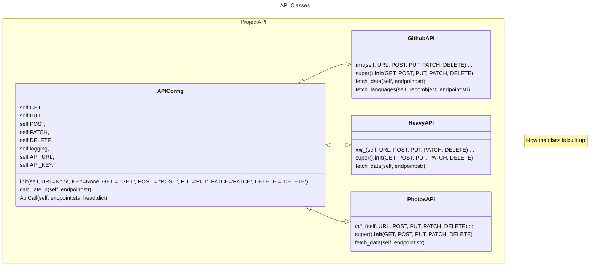

#   Visual representation of the Classes

##  API Classes

```mermaid
---
title: API Classes
---
classDiagram
    APIConfig <|--|>  GithubAPI
    APIConfig <|--|> HeavyAPI
    APIConfig <|--|> PhotosAPI

    note "How the class is built up"
    
    namespace Project API{

        class APIConfig {
            self.GET,
            self.PUT,
            self.POST,
            self.PATCH,
            self.DELETE,
            self.logging,
            self.API_URL,
            self.API_KEY,
        
            __init__(self, URL=None, KEY=None, GET = "GET", POST = "POST", PUT='PUT', PATCH='PATCH', DELETE = 'DELETE')
            calculate_n(self, endpoint:str)
            ApiCall(self, endpoint:sts, head:dict)
            
            }
        class PhotosAPI{
            _init__(self, URL, POST, PUT, PATCH, DELETE):
                super().__init__(GET, POST, PUT, PATCH, DELETE)
            fetch_data(self, endpoint:str)
        }
        class HeavyAPI{
            _init__(self, URL, POST, PUT, PATCH, DELETE):
                super().__init__(GET, POST, PUT, PATCH, DELETE)
            fetch_data(self, endpoint:str)
            }

        class GithubAPI{
            __init__(self, URL, POST, PUT, PATCH, DELETE):
                super().__init__(GET, POST, PUT, PATCH, DELETE)
            fetch_data(self, endpoint:str)
            fetch_languages(self, repo:object, endpoint:str)

        }

        
    }
```
