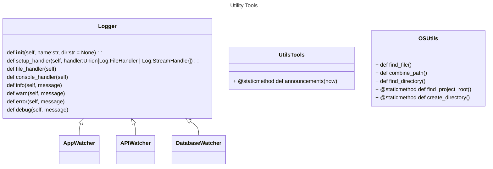

#   Visual representation of Utility tools

```mermaid
---
title: Utility Tools
---
 classDiagram

    Logger <|-- AppWatcher
    Logger <|-- APIWatcher
    Logger <|-- DatabaseWatcher


    class UtilsTools {
        + @staticmethod def announcements(now)
    }
    class OSUtils {
        + def find_file()
        + def combine_path()
        + def find_directory()
        + @staticmethod def find_project_root()
        + @staticmethod def create_directory()
    }
    class Logger {
        def __init__(self, name:str, dir:str = None):

        def setup_handler(self, handler:Union[Log.FileHandler | Log.StreamHandler]):
        
        def file_handler(self)
        def console_handler(self)
        
        def info(self, message)
        def warn(self, message)
        def error(self, message)
        def debug(self, message)
    }
```
## [OSUtils relationship with PhotoAPI](endpoints.md)
## [UtilsTools relationship with Announcement](endpoints.md)
